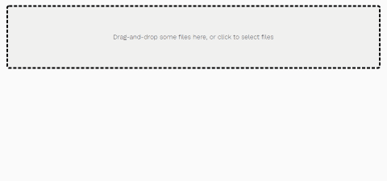

# React CSV Importer Monorepo

This library provides an uploader + CSV parser + raw file preview + UI for custom user column
mapping, all in one. You are looking at the monorepo root - here are some relevant links to start with:

- **[react-csv-importer on npm](https://www.npmjs.com/package/react-csv-importer)**
- [try the live editable code sandbox](https://codesandbox.io/s/github/beamworks/react-csv-importer/tree/master/demo-sandbox)
- [demo app](https://react-csv-importer.vercel.app/)
- [source code of the npm package](https://github.com/beamworks/react-csv-importer/tree/master/package-core)

